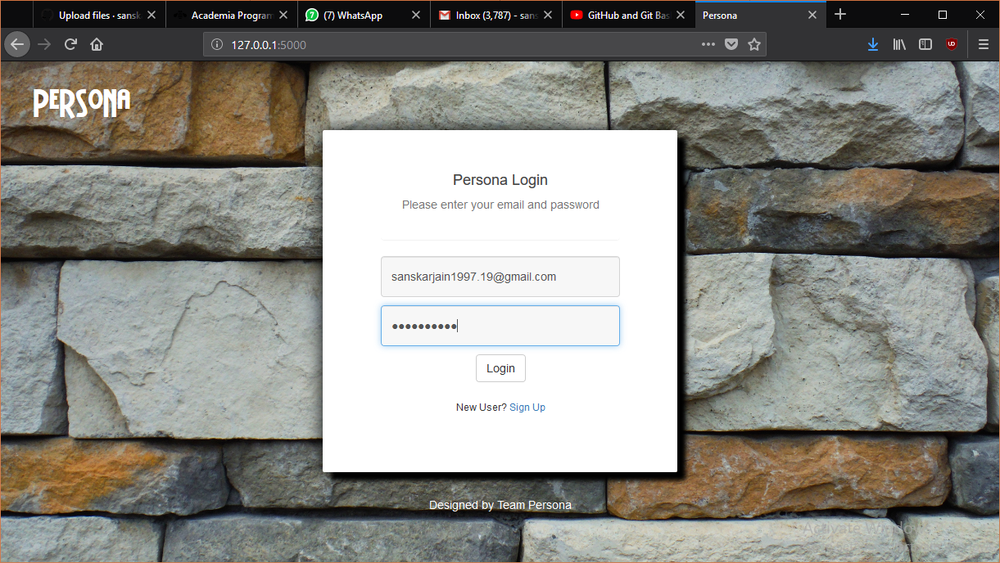
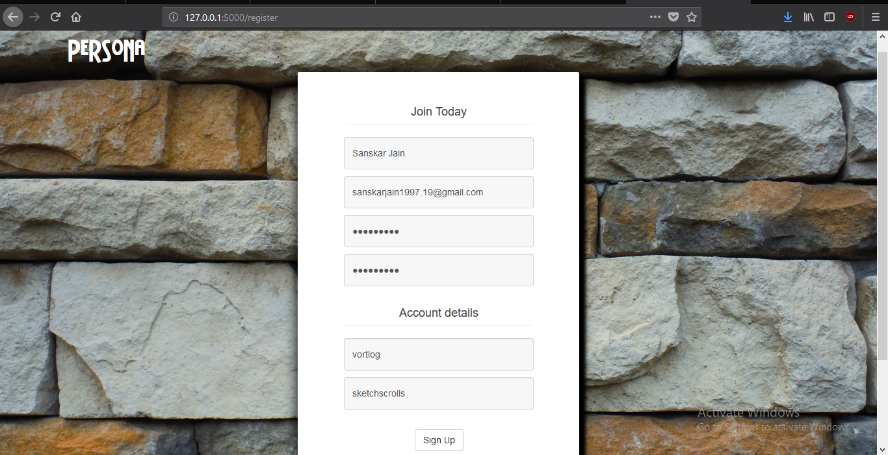
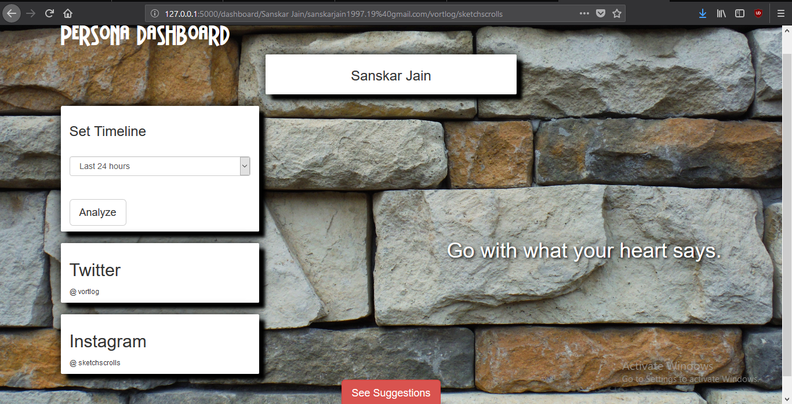
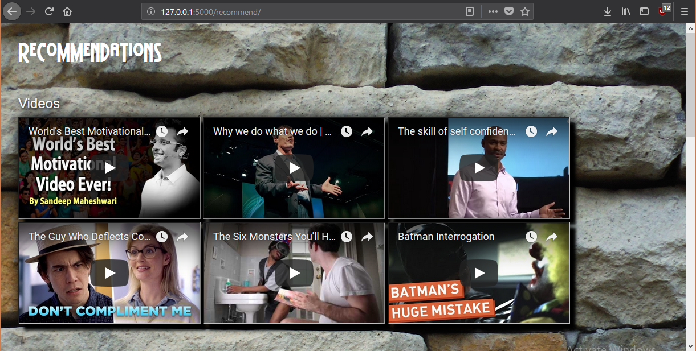

# Persona
It is the solution of the problem from IBM Hack Challenge - "Help me with my mood".
In this project, we analyse the tweets and Instagram posts of an user of previous 24 hours or more,
and perform sentiment analysis using IBM Watson Tone Analyzer. Then our algorithm provides media recommendations based on the
mood of the user to improve his/her mental health. Our algorithm is equipped with reinforcement learning which
opens a path for enhanced customized experience in future access. This is a Social-media Health Analysis and Display Engine (SHADE). Its main aim is to eliminate any negative state of mind that might have adverse effect on user's daily life.

Pre-requisities:

  Python and its packages :
  
    1. Flask
    2. Keras
    3. IBM-Tone-Analyzer
    4. Bcrypt
    5. json
    6. SQLAlchemy
    7. BeautifulSoup
    8. Python twitter REST APIs
    9. numpy
    
  Web Technologies:
  
    1. HTML
    2. CSS
    3. Bootstrap
    4. JavaScript

Steps to Use Persona

#### 1. First install all the required packages by using following commands:

```
pip install --upgrade keras
pip install --upgrade flask
pip install --upgrade bcrypt
pip install --upgrade json
pip install --upgrade python-twitter
pip install --upgrade wastson-developer-cloud
pip install --upgrade beautifulsoup4
pip install --upgrade flask-bcrypt
pip install --upgrade flask-sqlalchemy
pip install --upgrade flask-wtf
pip install --upgrade numpy
```
#### 2. Generate Keys and Tokens for Twitter app and update 'maal.py' in the project with your own keys and Tokens.

#### 3. Download and Extract the Repository at your preferred location.

#### 4. Now run the flask app to host the website locally. Default, hosting address for localhost is : 
```
127.0.0.1:5000
```


#### 5. Open the broswer (Chrome or Firefox is recommended) and enter the above the address as URL.

Here, you will get Login page. Enter the details to go to your dashboard. If you are using this
app for the first time, do registration first. Enter the following address to register as new user:

```
127.0.0.1:5000/register
```




#### 6. Once you get into the dashboard, you can set the time period for analyzing your tweets and instagram posts. 

Also, you can see your twitter username and Instagram username at left hand side. A Big Juicy Red Button, saying "See Suggestions", is at the mid-bottom and a one-line phrase/quote is at right hand side, which is given in accordance to the prominent mood of the user.

## IBM Tone Analyzer Usage :

First import the essential class called "ToneAnalyzerV3" from watson_developer_cloud module. Also import json for handling the output.

```
import json
from watson_developer_cloud import ToneAnalyzerV3
```

Initialize the serive with appropriate paramerter/credentials as shown below :
```
service = ToneAnalyzerV3(username='Your Username',password='Your password',version='2017-09-21')
```
'Your Usename' and 'Your Password' can easily be obtained from the IBM's official cloud website. There is a simple free registration on their cloud 'Bluemix' after which you can get your credentials.

Note : Monthly free API call limit for Tone Analyzer lite version is 2500. 

After that, use this service variable to determine the tone/sentiment of the phrase you are going to pass via 'tone' function
```
result = json.dumps(service.tone(tone_input=str('Your Text/Phrase'), content_type="text/plain", text=str('Your text/phrase')).get_result(), indent=2)
```
Result will have to be wrapped inside json.dumps function, which will return the string, containing scores for 'document_tone', that is the sentiment of whole paragraph you passed, and 'sentence_tone' which is the sentiment analysis for each sentence.

Your result may look like :
```
{
  "document_tone" : {
    "tones" : [ {
      "score" : 0.6165,
      "tone_id" : "sadness",
      "tone_name" : "Sadness"
    }, {
      "score" : 0.829888,
      "tone_id" : "analytical",
      "tone_name" : "Analytical"
    } ]
  },
  "sentences_tone" : [ {
    "sentence_id" : 0,
    "text" : "Team, I know that times are tough!",
    "tones" : [ {
      "score" : 0.801827,
      "tone_id" : "analytical",
      "tone_name" : "Analytical"
    } ]
  }, {
    "sentence_id" : 1,
    "text" : "Product sales have been disappointing for the past three quarters.",
    "tones" : [ {
      "score" : 0.771241,
      "tone_id" : "sadness",
      "tone_name" : "Sadness"
    }, {
      "score" : 0.687768,
      "tone_id" : "analytical",
      "tone_name" : "Analytical"
    } ]
  }, {
    "sentence_id" : 2,
    "text" : "We have a competitive product, but we need to do a better job of selling it!",
    "tones" : [ {
      "score" : 0.506763,
      "tone_id" : "analytical",
      "tone_name" : "Analytical"
    } ]
  } ]
}
```

for accessing the direct json object (i.e. dictionary of dictionaries/lists), use the following function ;

```
result = json.loads(result)
```

For accessing the tone_id of document_tone, write the following :
```
print(result['document_tone']['tones'][0]['tone_id'])
```

#### 7. Dashboard




### Phrases/Quotes corresponding to dominant emotion
```
For Anger : Calm Down. It seems Someone had a bad day.
For Sadness : Cheer up! Every cloud has a silver lining.
For Joy : Nice day. isn't it?
For Tentative : Go with what your heart says.
For Fear : Don't be scared. Everythings gonna be alright
For Confident : You are looking an inch taller.
For Analytical : Its good to be analytical.
```

When you'll click on the "See Suggestion" button, you will get redirected to our recommendation page. Here, all the Videos, Quotes, Memes, Images, Songs, Articles, Stories which are suitable for the user are listed in a simple format. 



## Extra Feature

# Watcher

There is also a Service called "watcher" which is made by us. This can be run by simply executing the following command in main directory :

```
python watcher.py
```
This service can run in background on a server, analyzing mood of users, stored in the database of the site to see whether any user shows some critical nature. If this is the case, personalized emails are sent to that user with recommendations.

Youtube Link of Persona's usage is :

```
https://youtu.be/OxmJJuA8hIw
```

